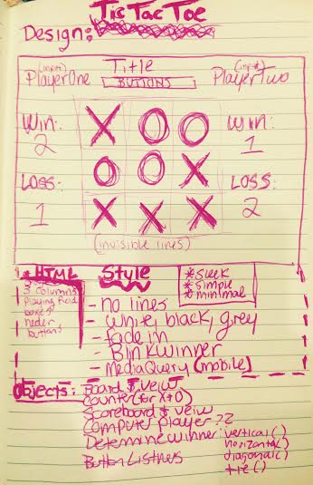

#Tic-Tac-Toe

##Technologies used
The game was built using the following
- **HTML**
- **CSS and BootStrap.com**
- **Javascript**
- **jQuery**

##Approach
I stored the whole game inside of one object. Inside of that object I have multiple properties, some of which are functions. From inside of these functions I am able to reference and manipulate other properties values.
I also tried to keep the property in the object at the view of that object on the browser seperate to keep my code more clean and readable.

##Instructions
(LINK HEREEEEEE)

##Unsolved Problems
- **When playing the Computer after the human move you can quickly take the computers move before the computer chooses.**
- **A way to know whose turn it is.**
-- **Occasional bugs when playing the computer**

##Wire Frame

##User Stories
- **Thhe user should be able to do the following**
1. Enter their name.
2. Play either a 1-player or 2-player game.
3. Track their wins and losses.
4. Reset their game.